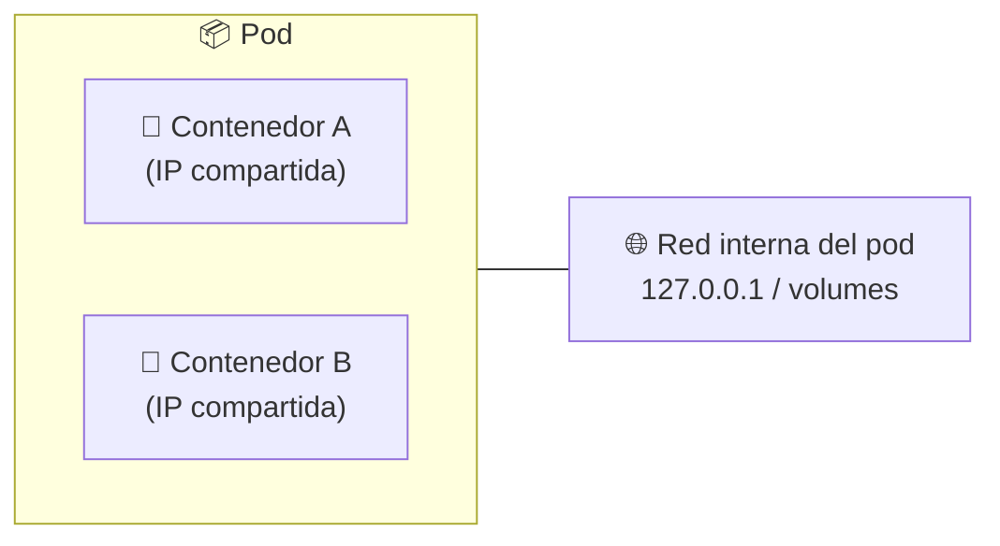
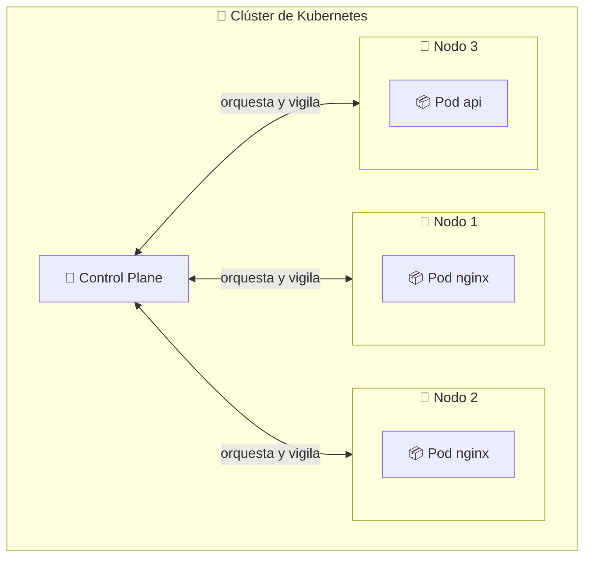

# 🚢 Introducción a Kubernetes

> Kubernetes (K8s) es la plataforma **open source** de orquestación de contenedores más usada en el mundo. Automatiza el despliegue, el escalado y la operación de aplicaciones en contenedores.

---

## 🧠 ¿Qué es Kubernetes?

Es un sistema que **orquesta contenedores** en un clúster de máquinas. Nace de la experiencia de Google con su plataforma interna de gestión de contenedores, llamada **Borg**, y su sucesor **Omega**. En 2015 Google donó Kubernetes a la **Cloud Native Computing Foundation (CNCF)**, donde evoluciona hoy como proyecto open source.

El nombre **Kubernetes** significa *"timonel"* o *"piloto"* en griego — haciendo alusión a la persona que dirige un barco, igual que K8s dirige tus contenedores. Por eso su logo es un timón. 🧭

## 🆚 ¿Por qué no usar Docker directamente?

Trabajar solo con Docker plantea varios retos:

| Problema | Descripción |
|----------|-------------|
| 🪜 **Escalabilidad** | Escalar una app implica copiar/pegar comandos `docker run` manualmente |
| 💀 **Failover** | Si un contenedor muere, nadie lo levanta de nuevo |
| 🖧 **Red** | Conectar y descubrir contenedores entre máquinas es manual y frágil |
| ♻️ **Actualizaciones** | Desplegar una nueva versión genera downtime |
| 🧹 **Gestión** | No hay forma declarativa de administrar el estado deseado |

**Kubernetes resuelve todo esto automáticamente.**

## ✅ Beneficios de Kubernetes

- 🔁 **Auto-reparación**: reinicia contenedores caídos y reemplaza los fallidos.
- 📈 **Escalado automático**: aumenta o reduce réplicas según demanda (HPA).
- 🎯 **Actualizaciones sin downtime** (rolling updates) y rollback automático.
- 💾 **Autodisciplina de estado**: se declara el estado *deseado* y K8s se encarga de llegar a él (declarativo).
- 🌐 **Balanceo de carga** y descubrimiento de servicios entre pods.
- 💽 **Persistencia de datos** con volúmenes.
- 📦 **Aprovisionamiento de infraestructura**: declaras disco, CPU y memoria.

## 🔑 Conceptos clave

| Concepto | Descripción |
|----------|-------------|
| 🖥️ **Clúster** | Conjunto de máquinas (nodos) que ejecutan aplicaciones en contenedores |
| 👑 **Master / Control Plane** | El "cerebro" del clúster: decide qué, dónde y cómo se ejecuta |
| 🔹 **Nodes (Nodes de trabajo)** | Máquinas donde realmente corren los contenedores |
| 📦 **Pod** | La unidad más pequeña de Kubernetes: uno o más contenedores que comparten red y almacenamiento |
| 🧩 **Deployment** | Declara el estado deseado de una app (imagen, réplicas, actualizaciones) |
| 🌐 **Service** | Expone los pods y balancea el tráfico entre ellos |
| 🗂️ **ConfigMap / Secret** | Configuración y datos sensibles inyectados a los contenedores |

> 🔍 **Un Pod es un "compañero de cuarto"**: los contenedores dentro de un mismo pod comparten la misma dirección IP, red y volúmenes.



## 🏛️ Alto nivel: ¿cómo funciona?



Le dices a Kubernetes **"quiero 3 réplicas de nginx"** y él se encarga del resto: crear los pods, distribuirlos, vigilarlos y reemplazarlos si fallan.

## 💻 Manos a la obra

Para empezar a practicar necesitas un clúster local. Vamos a ello:

```bash
# 1️⃣ Verificador de requisitos
minikube start --check-requirements

# 2️⃣ Iniciar un clúster en Docker
minikube start --driver=docker

# 3️⃣ Ver cómo responde el clúster
kubectl cluster-info
```

## 🧭 Siguiente paso

- ⚙️ [Clúster local con minikube](../02-local-cluster/README.md)
- 🏛️ [Arquitectura del clúster](../03-architecture/README.md)
- 🛠️ [kubectl y la API de Kubernetes](../04-kubectl-api/README.md)

---

🧠 *Resumen del módulo "Introducción a Kubernetes" del curso de Platzi.*