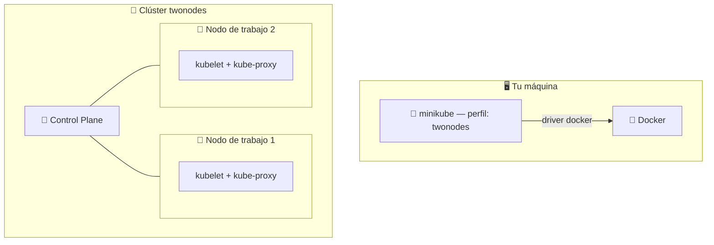
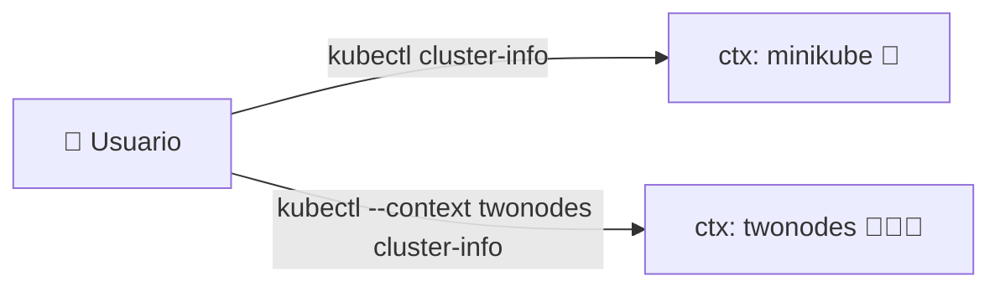
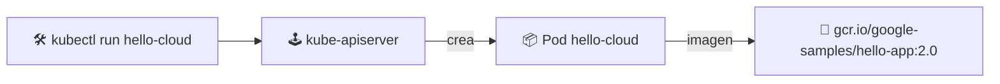

# 🖥️ Clúster local con minikube

> En este módulo levantamos un **clúster de Kubernetes en tu propia máquina** usando **minikube** y lo controlamos con **kubectl**.

## 📦 Requisitos previos

1. **Docker Desktop** (o un runtime de contenedores compatible) instalado y en ejecución.
2. **kubectl** — instálalo desde la [documentación oficial](https://kubernetes.io/es/docs/tasks/tools/).
3. **minikube** — instálalo desde la [documentación oficial](https://minikube.sigs.k8s.io/docs/start/).

```bash
# Comprobar versiones instaladas
kubectl version --client
minikube version
```

## 🚀 Iniciar minikube

Arrancar un clúster de un solo nodo con el driver de Docker:

```bash
minikube start --driver=docker
```

> 💡 La primera vez tarda unos minutos: descarga el binario de Kubernetes, configura el Control Plane y prepara el nodo de trabajo.

### 🧑‍🤝‍🧑 Clúster multi-nodo (2 nodos)

```bash
minikube start --nodes 2 -p twonodes --driver=docker
```



## 🪆 Utilidades de minikube

```bash
# Listar complementos (addons) disponibles
minikube addons list

# Habilitar el registry local y el metrics-server
minikube addons enable registry
minikube addons enable metrics-server
```

## 🔀 Apuntar kubectl a Docker (opcional)

Para construir imágenes directamente contra el Docker *dentro* del clúster:

```bash
eval $(minikube docker-env)
```

> ⚠️ **Windows / PowerShell**: `eval $(...)` es sintaxis **Bash** (Git Bash, WSL o Linux). En PowerShell se traduce a:
> ```powershell
> & minikube -p minikube docker-env --shell powershell | Invoke-Expression
> ```

## 🐳 Ver los contenedores del clúster

```bash
docker ps
```

Nota: tras ejecutar `eval $(minikube docker-env)`, `docker ps` muestra los contenedores del clúster de minikube. Para volver al Docker de tu host:

```bash
eval $(minikube docker-env -u)
```

## ℹ️ Info del clúster y contextos

```bash
kubectl cluster-info
kubectl config get-contexts
```



## 🔁 Cambiar el contexto de kubectl

```bash
kubectl config use-context <context-name>
```

Ejemplo: con dos perfiles activos (`minikube` y `twonodes`), cambia de uno a otro por su nombre de contexto.

## 📦 Crear un pod de prueba

```bash
kubectl run hello-cloud \
  --image=gcr.io/google-samples/hello-app:2.0 \
  --restart=Never \
  --port=8080

# Ver el pod y su estado
kubectl get pods
```



## ✅ Verificación rápida

| Comando | Para qué | Salida esperada |
|---------|----------|-----------------|
| `minikube status` | Estado del clúster | `host: Running` / `kubelet: Running` |
| `minikube dashboard` | UI web de Kubernetes | abre en el navegador |
| `kubectl get nodes` | Nodos registrados | `Ready` en todos |

## 🧭 Siguiente paso

- 🏛️ [Arquitectura del clúster](../03-architecture/README.md)
- 🛠️ [kubectl y la API de Kubernetes](../04-kubectl-api/README.md)

---

🧠 *Resumen del módulo "Clúster local" del curso de Platzi.*