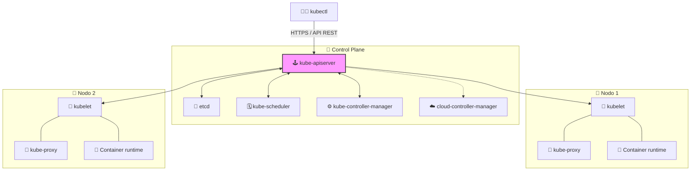
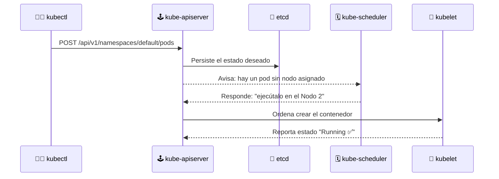

# 🏛️ Arquitectura de Kubernetes

> Un clúster de Kubernetes se divide en dos grandes planos: el **Control Plane** (el "cerebro") y los **Nodos de trabajo** (el "músculo"). Todo se coordina para que el clúster converja al estado deseado.

## 🧠 Vista general

> 🔑 **Regla de oro**: todos los componentes se comunican únicamente con el **kube-apiserver**. Los nodos **nunca** hablan directo con etcd, ni el scheduler con el kubelet.

## 👑 Plano de control (Control Plane)

| Componente | Función |
|------------|---------|
| 🕹️ **kube-apiserver** | Puerta de entrada del clúster. Expone la API REST, valida y administra los recursos. El único componente con el que interactúan kubectl y el resto. |
| 💾 **etcd** | Base de datos **clave-valor** donde se guarda todo el estado del clúster (la única fuente de verdad). |
| 🗓️ **kube-scheduler** | Decide **en qué nodo** se ejecuta cada pod nuevo según recursos, afinidades y restricciones. |
| ⚙️ **kube-controller-manager** | Ejecuta los *controladores*: vigila el estado real y lo ajusta al deseado (replica pods, detecta nodos caídos, gestiona endpoints...). |
| ☁️ **cloud-controller-manager** *(opcional)* | Integra APIs de nube (AWS, GCP, Azure): balanceadores, volúmenes y nodos gestionados. No aplica en minikube. |

## 🔹 Plano de datos (Nodos de trabajo)

| Componente | Función |
|------------|---------|
| 🔌 **kubelet** | Agente que corre en cada nodo. Arranca, supervisa y reporta el estado de los pods y contenedores. |
| 🔀 **kube-proxy** | Mantiene las reglas de red y el balanceo de carga hacia los pods (iptables/ipvs). |
| 🐳 **Container runtime** | Software que ejecuta contenedores (containerd, CRI-O, Docker). |

## ➕ Add-ons (complementos)

| Add-on | Función |
|--------|---------|
| 🌐 **CoreDNS** | Resolución de nombres dentro del clúster (los Services se descubren por DNS). |
| 📊 **metrics-server** | Recolecta métricas de CPU/memoria (base del autoescalado). |
| 🖥️ **Dashboard** | UI web para administrar el clúster. |

## 🔄 Flujo al crear un pod: declarativo

Cuando ejecutas `kubectl apply -f pod.yml`, ocurre lo siguiente:

## 🧠 Ideas clave

- **Declarativo**: declaras el *estado deseado* (ej. 3 réplicas) y Kubernetes converge hacia él continuamente.
- **Self-healing**: si un pod muere o un nodo cae, el *controller-manager* re-crea lo necesario en otro nodo.
- **API central**: todo pasa por `kube-apiserver`; etcd es solo lectura/escritura desde ahí.

## 🧭 Siguiente paso

- 🛠️ [kubectl y la API de Kubernetes](../04-kubectl-api/README.md)

---

🧠 *Resumen del módulo "Arquitectura" del curso de Platzi.*