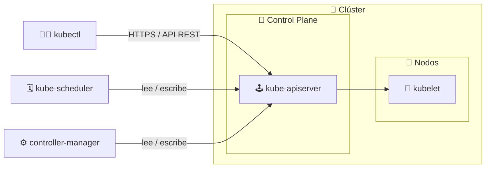
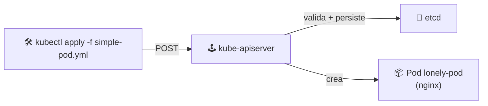
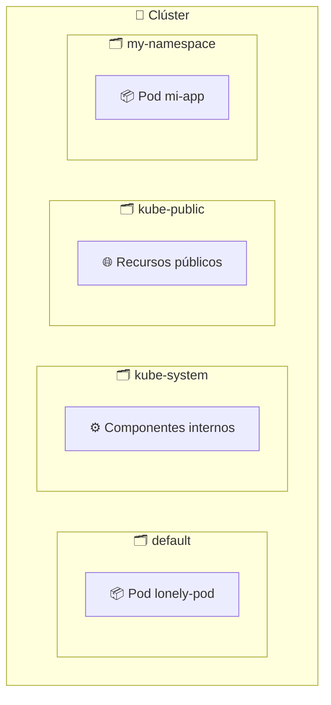

# 🛠️ kubectl y la API de Kubernetes

> La **API de Kubernetes** es el corazón del clúster: una interfaz **RESTful** por la que pasan todas las operaciones. **kubectl** es la CLI oficial que la consume.

## 🕹️ ¿Qué es la API de Kubernetes?

Es el **único punto de entrada** del clúster. Tanto los componentes internos (kube-scheduler, kube-controller-manager, kubelet...) como las herramientas externas (kubectl) hablan con el clúster únicamente a través de ella.



### Características

| Característica | Descripción |
|----------------|-------------|
| ✅ **RESTful** | Recursos accesibles por HTTP con métodos estándar (`GET`, `POST`, `PUT`, `DELETE`) |
| 🔄 **CRUD** | Permite crear, leer, actualizar y eliminar Pods, Deployments, Services, ConfigMaps... |
| 🧩 **Extensible** | Soporta recursos personalizados mediante **CRDs** (Custom Resource Definitions) |
| 🗄️ **Persistencia** | Toda la información se almacena en **etcd** a través de la API |

Por ejemplo, cuando ejecutas `kubectl get pods`, kubectl envía una petición HTTP al **kube-apiserver** y éste responde con la lista de Pods.

## 🧰 kubectl: el cliente oficial

`kubectl` es la herramienta de línea de comandos que permite **consultar, crear, actualizar y eliminar** recursos en el clúster.

### Comandos básicos

| Acción | Comando | Ejemplo |
|--------|---------|---------|
| 👀 Consultar recursos | `kubectl get <recurso>` | `kubectl get pods` |
| 📋 Describir un recurso | `kubectl describe <recurso> <nombre>` | `kubectl describe pod lonely-pod` |
| 📝 Aplicar cambios desde YAML | `kubectl apply -f <archivo.yaml>` | `kubectl apply -f simple-pod.yml` |
| 🗑️ Eliminar un recurso | `kubectl delete <recurso> <nombre>` | `kubectl delete pod lonely-pod` |

> 📄 En esta carpeta tienes el manifiesto [simple-pod.yml](simple-pod.yml), un Pod de nginx listo para aplicar:

```yaml
apiVersion: v1
kind: Pod
metadata:
  name: lonely-pod
  labels:
    app: nginx
spec:
  containers:
    - name: nginx
      image: nginx:latest
      ports:
        - containerPort: 80
```



## 🗂️ Namespaces

Un **namespace** divide y agrupa los recursos dentro del clúster, permitiendo **entornos aislados** para distintos proyectos o equipos.

### Características clave

- 🔒 **Aislamiento lógico**: pods, services y deployments se agrupan por separado; puede existir el mismo nombre de recurso en distintos namespaces sin conflicto.
- ⚖️ **Recursos compartidos**: CPU y memoria son del clúster completo, pero puedes fijar **cuotas por namespace** (ResourceQuota) para controlar el uso.



### Namespaces por defecto

| Namespace | Descripción |
|-----------|-------------|
| 🌱 `default` | Es donde se crean los objetos que **no** especifican namespace |
| ⚙️ `kube-system` | Componentes internos del sistema Kubernetes (api-server, etcd, CoreDNS...) |
| 🌍 `kube-public` | Accesible por todos los usuarios; recursos visibles públicamente en el clúster |

### Listar namespaces

```bash
kubectl get namespaces
# SALIDA
# default           Active   4d
# kube-node-lease   Active   4d
# kube-public       Active   4d
# kube-system       Active   4d
```

> 💡 Aunque no lo enseña el curso, minikube además crea `kube-node-lease`, usado para los *leases* de los nodos (heartbeat y detección de caídas).

### Crear un namespace — imperativo

```bash
kubectl create namespace my-namespace
```

### Crear un namespace — declarativo

```yaml
apiVersion: v1
kind: Namespace
metadata:
  name: my-namespace
```

```bash
kubectl apply -f namespace.yml
```

### Trabajar dentro de un namespace

```bash
# Ver los pods de un namespace concreto
kubectl get pods -n my-namespace

# Usar kubectl siempre contra ese namespace
kubectl config set-context --current --namespace=my-namespace
```

## 🧠 Resumen CRUD con kubectl

| Recurso | Planos API | Verbo kubectl |
|---------|-----------|---------------|
| Pods | `v1` | `get`, `describe`, `apply`, `delete` |
| Namespaces | `v1` | `get`, `create`, `apply` |

## 🧭 Siguiente paso

- ↩️ [Módulo anterior: Arquitectura](../03-architecture/README.md)

---

🧠 *Resumen del módulo "kubectl y la API" del curso de Platzi.*