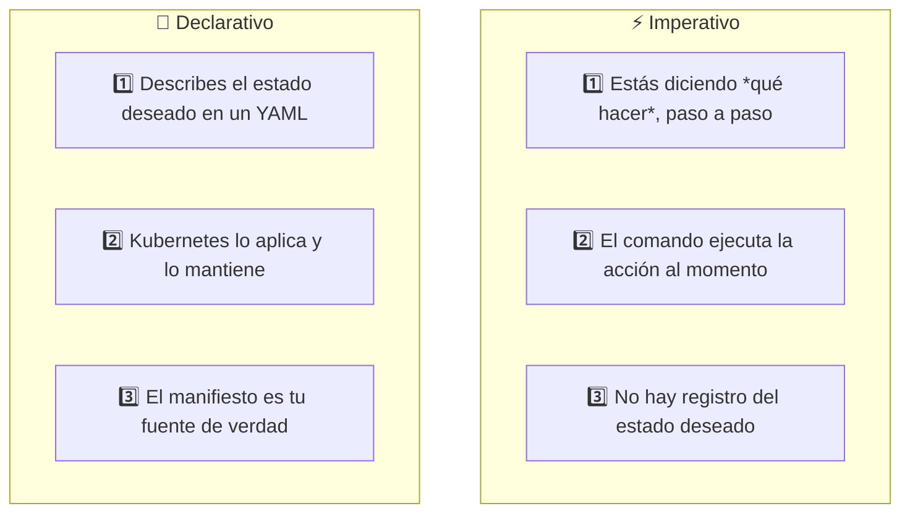
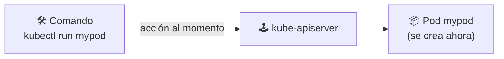
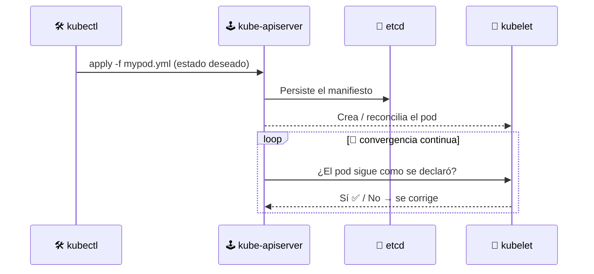

# ⚖️ Declarativo vs Imperativo

> Los dos grandes paradigmas para administrar Kubernetes. Ya sea por **comandos** (imperativo) o por **manifiestos YAML** (declarativo), Kubernetes siempre converge al estado que le declares.

## 🧠 El paradigma



| | ⚡ Imperativo | 🎯 Declarativo |
|---|---|---|
| **Filosofía** | *"Haz esto ahora"* | *"Este es el estado que quiero"* |
| **Interacción** | Comandos sueltos (`kubectl run`, `create`, `delete`) | Archivos YAML (`kubectl apply -f`) |
| **Reproducibilidad** | Baja — hay que repetir comandos | Alta — el YAML viaja y se versiona (GitOps) |
| **Auditoría / historia** | No queda registro de *qué* ni *cómo* | El manifiesto documenta el qué |
| **Escribir / leer** | *Opaco*: la configuración vive solo en el clúster | *Transparente*: el archivo muestra el estado completo |
| **Caso de uso** | Pruebas rápidas, debugging | Aplicaciones en producción |

## 📋 Las tres formas de interactuar con kubectl

La [documentación oficial](https://kubernetes.io/es/docs/concepts/overview/working-with-objects/object-management/) reconoce tres estilos:

| Estilo | Ejemplos | Estado deseado |
|--------|----------|----------------|
| ⚡ **Comandos imperativos** | `kubectl run`, `kubectl create`, `kubectl delete`, `kubectl scale`, `kubectl expose` | No queda escrito en ningún archivo |
| 📝 **Config imperativa** | `kubectl create -f`, `kubectl replace -f`, `kubectl delete -f` | Sí, en el YAML — pero la definición *reemplaza* la actual |
| 🎯 **Config declarativa** | `kubectl apply -f` (archivos o directorios) | Sí, en el YAML — Kubernetes hace *diff* y converge |

> 🔑 **Diferencia sutil**: `create -f` solo **crea** (falla si existe); `apply -f` **crea o actualiza** aplicando solo lo que cambió (merge). Por eso `apply` es el estándar en la práctica.

## ⚡ Imperativo: acciones directas

Cada comando es una **instrucción puntual**. Crea, consulta, cambia y elimina al vuelo:

```bash
# Pod directo (sin YAML)
kubectl run mypod --image=nginx

# Escalar un deployment sin tocar archivos
kubectl scale deployment myapp --replicas=5

# Consultar lo que hay
kubectl get pods

# Crear recursos con nombre explícito
kubectl create namespace mi-equipo

# Eliminación directa por nombre
kubectl delete pod mypod
```



> ⚠️ **Desventaja**: si el pod muere, tu comando ya no existe en ninguna parte. Tú eres el único "fuente de la verdad". Además, mezclar comandos imperativos con declarativos puede **machacar** cambios que otro equipo declaró en YAML.

## 🎯 Declarativo: manifiestos YAML

Declaras el resultado y Kubernetes se encarga de alcanzarlo. El archivo [mypod.yml](mypod.yml) de esta carpeta:

```yaml
apiVersion: v1
kind: Pod
metadata:
  name: mypod
spec:
  containers:
  - name: mycontainer
    image: nginx
```

```bash
# Ver qué cambiaría ANTES de aplicar (no toca el clúster)
kubectl diff -f mypod.yml

# Aplicar el manifiesto (crear o actualizar)
kubectl apply -f mypod.yml

# Simular sin aplicar
kubectl apply -f mypod.yml --dry-run=client

# Consultar su estado
kubectl get pod mypod

# Eliminar todo lo declarado en el archivo
kubectl delete -f mypod.yml
```



> ✨ **Poder declarativo**: si borras el pod o baja el nodo, Kubernetes **re-crea** lo que el manifiesto declara. El clúster pelea solo por mantenerse en ese estado.

## 🧪 Misma tarea, dos caminos

| Tarea | ⚡ Imperativo | 🎯 Declarativo |
|-------|---------------|----------------|
| Crear pod nginx | `kubectl run mypod --image=nginx` | `kubectl apply -f mypod.yml` |
| Crear namespace | `kubectl create namespace mi-equipo` | `kubectl apply -f namespace.yml` |
| Ver pods | `kubectl get pods` | `kubectl get pods` |
| Cambiar imagen | `kubectl set image pod/mypod mycontainer=nginx:2` | editar YAML + `kubectl apply -f mypod.yml` |
| Eliminar | `kubectl delete pod mypod` | `kubectl delete -f mypod.yml` |

> 🍳 **Analogía**: imperativo es un chef dando *"añade sal, remueve al minuto 3"*; declarativo es entregar una **receta escrita**: el resultado final estará especificado sin importar quién (o qué) lo cocine.

## 🏆 Buenas prácticas

- ✅ Usa **declarativo** siempre que el recurso sea importante: versiona los manifiestos en Git (**GitOps**). El repositorio es la única fuente de verdad y un pipeline aplica los cambios.
- ✅ Antes de desplegar, usa `kubectl diff -f <archivo>` para revisar qué cambiará: evita sorpresas en producción.
- ✅ Cuanto más grande el clúster, menos imperativo: los imperativos no escalan, no se auditan y pueden romper el estado declarado.
- ⚡ El imperativo es útil para explorar, hacer pruebas de humo y debugging rápido.
- 👀 Para inspeccionar, ambos caminos se unifican: leer recursos también acepta manifiestos (`kubectl get -f mypod.yml`).

## 🧭 Navegación

- 🛠️ [Módulo anterior: kubectl y la API](../04-kubectl-api/README.md)
- ↩️ [Inicio del curso](../README.md)

---

🧠 *Resumen del módulo "Declarativo vs Imperativo" del curso de Platzi.*