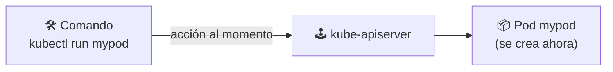
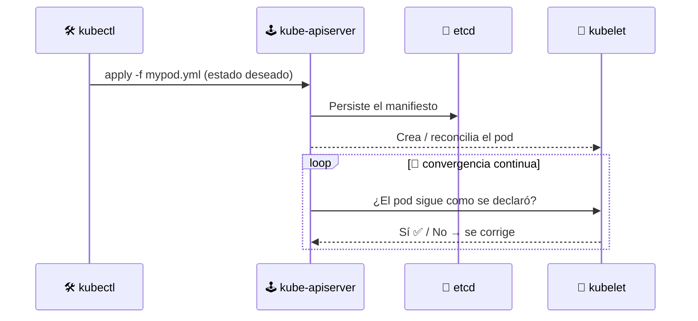

# ⚖️ Declarativo vs Imperativo

> Los dos grandes paradigmas para administrar Kubernetes. Ya sea por **comandos** (imperativo) o por **manifiestos YAML** (declarativo), Kubernetes siempre converge al estado que le declares.

## 🧠 El paradigma


| | ⚡ Imperativo | 🎯 Declarativo |
|---|---|---|
| **Filosofía** | *"Haz esto ahora"* | *"Este es el estado que quiero"* |
| **Interacción** | Comandos sueltos (`kubectl run`, `create`, `delete`) | Archivos YAML (`kubectl apply -f`) |
| **Reproducibilidad** | Baja — hay que repetir comandos | Alta — el YAML viaja y se versiona (GitOps) |
| **Auditoría / historia** | No queda registro de *qué* ni *cómo* | El manifiesto documenta el qué |
| **Caso de uso** | Pruebas rápidas, rayos de debug | Aplicaciones en producción |

## ⚡ Imperativo: acciones directas

Cada comando es una **instrucción puntual**. Crea, consulta y elimina al vuelo:

```bash
# Pod directo (sin YAML)
kubectl run mypod --image=nginx

# Consultar lo que hay
kubectl get pods

# Crear recursos con nombre explícito
kubectl create namespace mi-equipo

# Eliminación directa por nombre
kubectl delete pod mypod
```



> ⚠️ **Desventaja**: si el pod muere, tu comando ya no existe en ninguna parte. Tú eres el único "fuente de la verdad".

## 🎯 Declarativo: manifiestos YAML

Declaras el resultado y Kubernetes se encarga de alcanzarlo. El archivo [mypod.yml](mypod.yml) de esta carpeta:

```yaml
apiVersion: v1
kind: Pod
metadata:
  name: mypod
spec:
  containers:
  - name: mycontainer
    image: nginx
```

```bash
# Aplicar el manifiesto (crear o actualizar)
kubectl apply -f mypod.yml

# Consultar su estado
kubectl get pod mypod

# Eliminar todo lo declarado en el archivo
kubectl delete -f mypod.yml
```



> ✨ **Poder declarativo**: si borras el pod o baja el nodo, Kubernetes **re-crea** lo que el manifiesto declara. El clúster pelea solo por mantenerse en ese estado.

## 🧪 Misma tarea, dos caminos

| Tarea | ⚡ Imperativo | 🎯 Declarativo |
|-------|---------------|----------------|
| Crear pod nginx | `kubectl run mypod --image=nginx` | `kubectl apply -f mypod.yml` |
| Ver pods | `kubectl get pods` | `kubectl get pods` |
| Eliminar | `kubectl delete pod mypod` | `kubectl delete -f mypod.yml` |

## 🏆 Buenas prácticas

- ✅ Usa **declarativo** siempre que el recurso sea importante: versiona los manifiestos en Git (**GitOps**).
- ✅ Cuanto más grande el clúster, menos imperativo: los imperativos no escalan ni se auditan.
- ⚡ El imperativo es útil para explorar, hacer pruebas de humo y debugging rápido.
- 👀 Para inspeccionar ambos caminos se unifican: leer recursos también acepta manifiestos (`kubectl get -f mypod.yml`).

## 🧭 Navegación

- 🛠️ [Módulo anterior: kubectl y la API](../04-kubectl-api/README.md)
- ↩️ [Inicio del curso](../README.md)

---

🧠 *Resumen del módulo "Declarativo vs Imperativo" del curso de Platzi.*