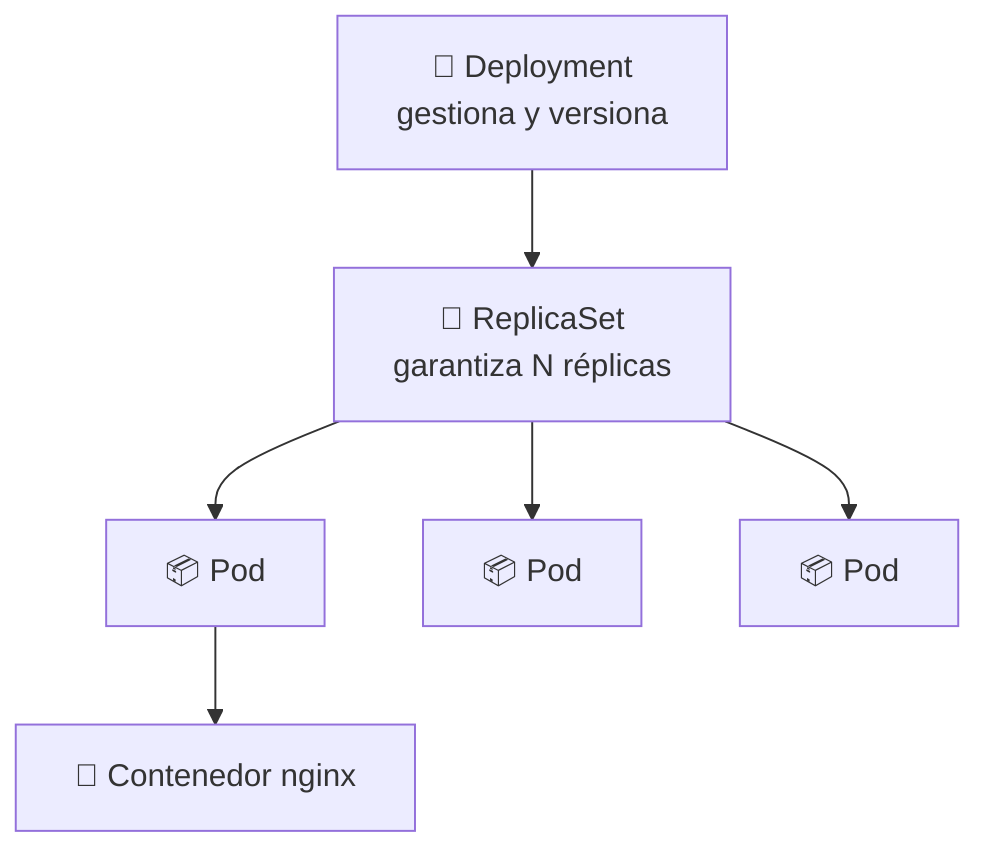
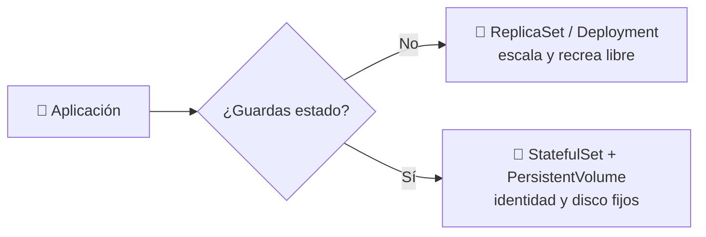
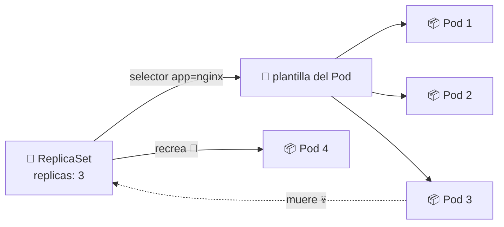
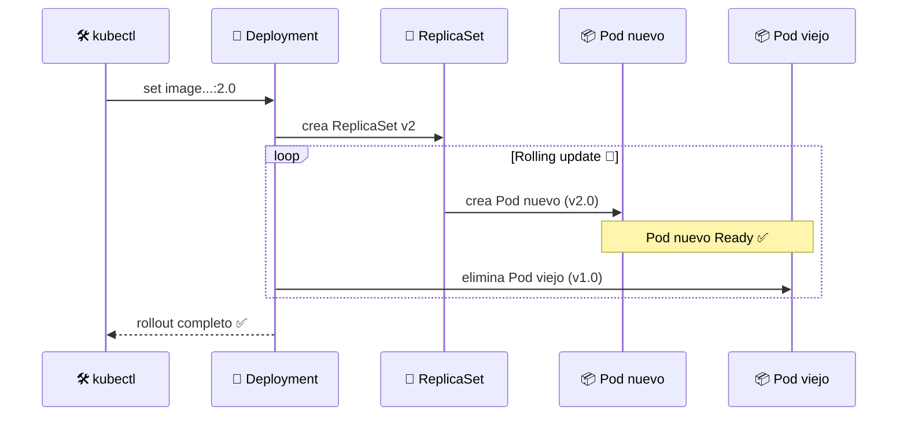

# 📦 Pods, ReplicaSets y Deployments

> Las tres piezas fundamentales para ejecutar aplicaciones en Kubernetes: del **Pod** (la unidad mínima) al **Deployment** (la gestión declarativa definitiva).

## 🪜 Jerarquía



| Recurso | Nivel | Responsabilidad |
|---------|:-----:|-----------------|
| 📦 **Pod** | 1 | Unidad más pequeña: uno o más contenedores |
| 🔁 **ReplicaSet** | 2 | Mantiene siempre el número exacto de réplicas |
| 🚢 **Deployment** | 3 | Orquesta ReplicaSets: actualizaciones, rollback, escalado |

## 📦 Pods: la unidad mínima

Un Pod es la unidad más pequeña y básica de Kubernetes. Representa una instancia de una aplicación en ejecución. Puede contener **uno o más contenedores** que comparten:

- 🌐 **Red**: todos los contenedores del Pod comparten la misma IP y puertos.
- 💾 **Almacenamiento**: pueden compartir volúmenes montados.
- 🔄 **Ciclo de vida**: se crean, ejecutan y eliminan juntos.

### Forma imperativa (CLI)

```bash
# Crear un pod de nginx
kubectl run nginx-nodeport --image=nginx --restart=Never --port=80

# Ver pods existentes
kubectl get pods

# Exponer el pod localmente (túnel 8080 → 80 interno)
kubectl port-forward pod/nginx-nodeport 8080:80
```

> ⚠️ **Desventaja del Pod solo**: si el Pod muere, **no se recrea**. Ningún replicador lo vigila.

## 💾 Stateless vs Stateful: tener o no tener estado

En Kubernetes, las aplicaciones pueden ser **stateless** (sin estado) o **stateful** (con estado). Esto condiciona cómo se diseñan y gestionan los Pods.

| | 💨 Stateless | 🧱 Stateful |
|---|---|---|
| **Datos persistentes** | No guarda nada entre reinicios | Guarda estado y datos |
| **Ejemplo** | Nginx, APIs que procesan HTTP | MySQL, Redis, bases de datos |
| **Escalado** | Sencillo: sumas/quitas réplicas sin riesgo | Complejo: hay que preservar consistencia |
| **Almacenamiento** | No necesita volúmenes | Requiere **Persistent Volumes** (PV) |
| **Identidad** | Pods intercambiables | Cada Pod necesita identidad única y fija |

> 🎯 El escalado "fácil" de Kubernetes (ReplicaSets/Deployments) apunta a cargas **stateless**. Las cargas **stateful** usan recursos dedicados como **StatefulSet**.



## 🔁 ReplicaSets: garantizar disponibilidad

El ReplicaSet **asegura que siempre esté corriendo el número de réplicas declarado**. Si un Pod muere o se borra, se crea una réplica al instante.

### Manifiesto [replicaset.yml](replicaset.yml)

```yaml
apiVersion: apps/v1
kind: ReplicaSet
metadata:
  name: nginx-replicaset
  labels:
    app: nginx
spec:
  replicas: 3
  selector:
    matchLabels:
      app: nginx
  template:
    metadata:
      labels:
        app: nginx
    spec:
      containers:
      - name: nginx
        image: nginx:latest
        ports:
        - containerPort: 80
```



### Forma declarativa

```bash
kubectl apply -f replicaset.yml

# Ver réplicas y pods
kubectl get replicaset
kubectl get pods

# Matar un Pod a propósito: el RS lo repone al instante
kubectl delete pod nginx-replicaset-<pod-id>
kubectl get pods
```

> 🔑 **El `selector.matchLabels` es clave**: el ReplicaSet "encuentra" sus Pods por las etiquetas, no por nombre.

## 🚢 Deployments: gestión declarativa completa

Un **Deployment** es una **capa superior** que gestiona ReplicaSets y aporta:

- 🎯 Gestión **declarativa** de la aplicación.
- 🔄 **Rolling updates** sin downtime (actualiza Pod por Pod).
- ↩️ **Rollback** a una versión anterior.
- 🔀 **Escalado** declarativo (editar `replicas` y `kubectl apply`).

### Manifiesto [deployment.yml](deployment.yml)

```yaml
apiVersion: apps/v1
kind: Deployment
metadata:
  name: hello-deployment
  labels:
    app: hello
spec:
  replicas: 4
  selector:
    matchLabels:
      app: hello
  template:
    metadata:
      labels:
        app: hello
    spec:
      containers:
      - name: hello-app
        image: gcr.io/google-samples/hello-app:1.0
        ports:
        - containerPort: 8080
```

### Ciclo de vida: aplicar, actualizar, revertir

```bash
# 1️⃣ Crear / aplicar
kubectl apply -f deployment.yml

kubectl get deployment
kubectl get pods

# 2️⃣ Actualizar la imagen (dispara un rolling update)
kubectl set image deployment/hello-deployment hello-app=gcr.io/google-samples/hello-app:2.0

# 3️⃣ Seguir el progreso del rollout
kubectl rollout status deployment/hello-deployment

# 4️⃣ Verificar los Pods ya actualizados
kubectl get pods

# 5️⃣ Volver atrás si algo falló
kubectl rollout undo deployment/hello-deployment

# 6️⃣ Exponer el deployment localmente
kubectl port-forward deploy/hello-deployment 8080:8080
```



## ⚖️ ¿Cuándo usar cada uno?

| Necesitas... | Usa |
|--------------|:---:|
| Un contenedor suelto para una prueba rápida | 📦 Pod |
| Mantener siempre N replicas | 🔁 ReplicaSet |
| Actualizaciones, rollback y escalado en producción | 🚢 Deployment |

> 💡 En la práctica real casi siempre se usa **Deployment**. Un Deployment ya crea su propio ReplicaSet internamente.

## 🧭 Navegación

- ⚖️ [Módulo anterior: Declarativo vs Imperativo](../05-declarative-vs-imperative/README.md)
- ↩️ [Inicio del curso](../README.md)

---

🧠 *Resumen del módulo "Pods, ReplicaSets y Deployments" del curso de Platzi.*