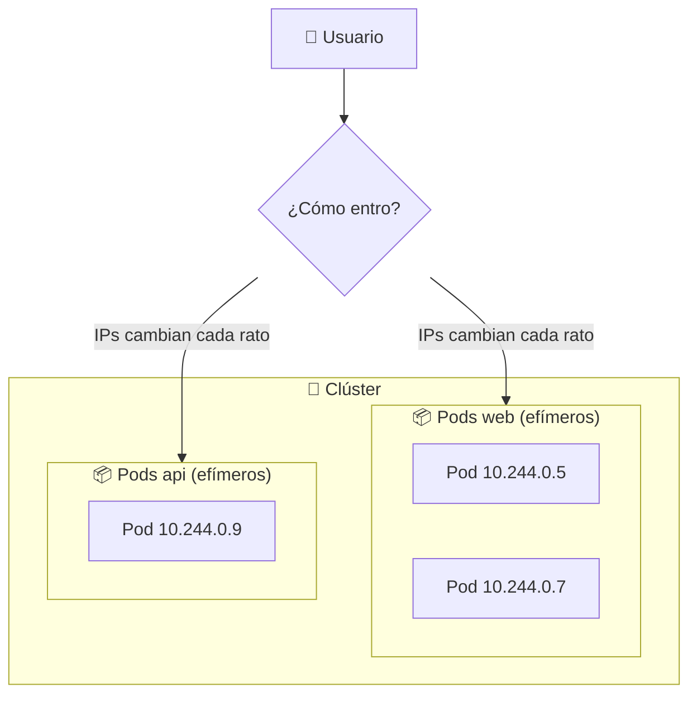
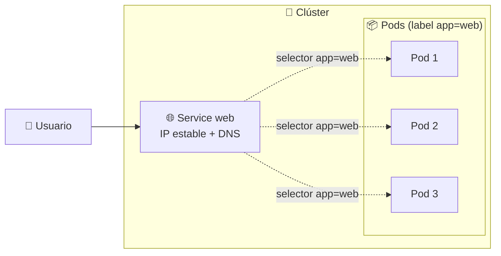
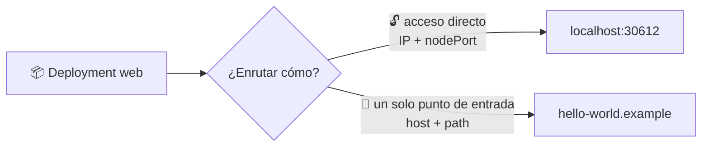
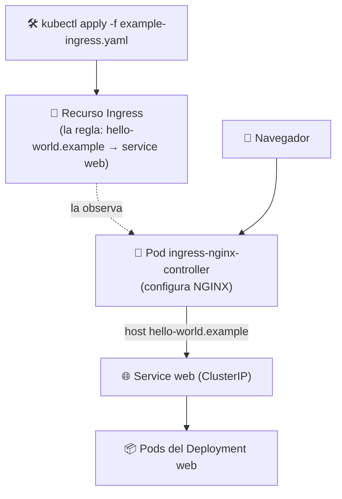

# 🌐 Services e Ingress

> Un Deployment gestiona la aplicación *por dentro* del clúster, pero ¿cómo llegan los clientes? Aquí entran **Services** (exposición interna/externa) e **Ingress** (puerta de entrada con rutas y hostnames).

## 🧩 El problema: dar acceso a los Pods

Los Pods son **efímeros**: se crean, se mueren y se reemplazan con otras IPs. No puedes decirle a un cliente "conéctate a esta IP".



**Solución**: un **Service** es una dirección **estable** que agrupa un conjunto de Pods por etiquetas y balancea el tráfico entre ellos.



## 🌐 Types de Service

| Tipo | Alcance | Para qué |
|------|---------|----------|
| 🏠 **ClusterIP** *(default)* | Interno | Acceso solo dentro del clúster; DNS propio |
| 🔓 **NodePort** | Externo | Expone el Service en un puerto fijo de cada nodo (`30000-32767`) |
| ☁️ **LoadBalancer** | Externo | Crea un balanceador en la nube (AWS, GCP, Azure) que enruta a los NodePorts |

## 📦 Paso 1: desplegar la app de ejemplo

Tanto NodePort como Ingress necesitan primero un Deployment funcionando:

```bash
kubectl create deployment web --image=gcr.io/google-samples/hello-app:1.0
kubectl get pods
```

## 🛣️ Paso 2: decidir cómo enrutar — NodePort o Ingress

Un mismo Deployment se puede exponer de dos formas **distintas** (elegimos una u otra):



| Característica | 🔓 NodePort | 🚪 Ingress |
|----------------|-------------|------------|
| Qué expones | Un puerto por Service | La puerta 80/443 del clúster |
| Cómo accede el usuario | `localhost:<nodePort>` | Por hostname/path (`hello-world.example`) |
| Muchos servicios | Muchos puertos → caos | Un solo entrypoint que enruta |
| Tres fases | Deploy + Service | Deploy + Service + regla Ingress |

> 💡 Ambos caminos parten del **mismo Deployment**. La diferencia está en **qué recurso** creas después para exponerlo.

### 🔓 Camino A: NodePort — acceso directo por IP:puerto

Es lo más simple: un Service tipo NodePort con un puerto fijo del nodo.

```bash
kubectl expose deployment web --type=NodePort --port=8080

# Descubrir el nodePort asignado (segundo número en 8080:XXXXX)
kubectl get svc web
#   NAME   TYPE      CLUSTER-IP   PORT(S)          ...
#   web    NodePort  10.100...   8080:30612/TCP
```

> 🔑 `--port=8080` es el puerto **interno** (ClusterIP). Con NodePort, Kubernetes asigna un **nodePort** aleatorio del rango `30000-32767` que es el que se abre desde fuera.

| Entorno | Acceso al NodePort |
|---------|--------------------|
| 🌀 minikube | `minikube service web --url` o `http://<IP-minikube>:<nodePort>`; Docker Desktop *no* enruta esa IP |
| 🐳 Docker Desktop | `http://localhost:<nodePort>` (ej. `http://localhost:30612`) |

> 🌍 Diagnóstico rápido de qué URL funciona:
>
> | URL | Resultado | Por qué |
> |-----|-----------|---------|
> | `http://localhost:8080` | ⏱️ timeout | Es el puerto **interno** ClusterIP |
> | `http://localhost:<nodePort>` | ✅ 200 | Es el puerto real expuesto del nodo |
> | `http://<IP-del-nodo>:<nodePort>` | ⏱️ timeout | La IP de la VM no es enrutable desde Windows |

#### 💡 Alternativas al NodePort

```bash
# A) LoadBalancer: Docker Desktop lo mapea a localhost directo (puerto fijo)
kubectl delete svc web
kubectl expose deployment web --type=LoadBalancer --port=8080
# → http://localhost:8080  ✅

# B) port-forward: para pruebas rápidas sin tocar el Service
kubectl port-forward service/web 8080:8080
# → http://localhost:8080  ✅
```

### 🚪 Camino B: Ingress — un solo punto de entrada

Ingress resuelve el problema de los miles de puertos: un **único entrypoint** (HTTP/HTTPS) que enruta por **hostname** o **path** al Service correcto.

Requiere **cuatro fases**: instalar el controlador → verificar → crear la regla → acceder.

#### 1️⃣ Instalar el controlador (una vez por clúster)

Sin el controlador, ninguna regla Ingress funciona. Puedes instalarlo de dos formas:

```bash
# 🌀 Opción A: con minikube (addon)
minikube addons enable ingress
```

```bash
# 🐳 Opción B: sin minikube (Docker Desktop, kubeadm, cloud)
#    Reemplaza el tag por la última versión estable del release
kubectl apply -f https://raw.githubusercontent.com/kubernetes/ingress-nginx/controller-v1.14.5/deploy/static/provider/cloud/deploy.yaml
kubectl get ingressclass
```

> 📦 **Alternativa con Helm**: `helm upgrade --install ingress-nginx ingress-nginx --repo https://kubernetes.github.io/ingress-nginx --namespace ingress-nginx --create-namespace`

| | 🌀 minikube | 🐳 Directo |
|---|---|---|
| Instalación | `minikube addons enable ingress` | `kubectl apply -f <deploy.yaml>` |
| Compatibilidad | Solo minikube | Cualquier clúster |
| Naturaleza | Atajo que aplica los mismos manifiestos | Manifiestos oficiales del proyecto |

#### 2️⃣ Verificar que el controlador esté corriendo

```bash
kubectl get pods -n ingress-nginx
```

> 🔍 **¿Qué hace este comando?** Lista los pods del **NGINX Ingress Controller** (el namespace `ingress-nginx` se creó en el paso 1). No crea nada: solo **verifica**.
>
> Es la **condición** para que el Ingress funcione: si esos pods no están `Running`, podrás crear el recurso `example-ingress.yaml` pero **nadie lo procesará** y no se enrutará tráfico.
>
> ✅ Salida esperada: al menos un pod `ingress-nginx-controller-xxxx` en `Running`, `1/1 READY`.

```bash
# Además, ve el Service que abre la puerta (LoadBalancer)
kubectl get svc -n ingress-nginx
```

#### 3️⃣ Crear la regla de enrutamiento (el recurso Ingress)

Aquí entra en juego `example-ingress.yaml`: es la **regla** que dice "cuando llegue el host `hello-world.example`, manda el tráfico al Service `web`".



Para diferenciarlo bien, **tres objetos distintos**, creados en distintos pasos:

| Objeto | Qué es | Se crea con |
|--------|--------|-------------|
| 🐳 Pod `ingress-nginx-controller` | El controlador: lee reglas y configura NGINX | `deploy.yaml` (paso 1️⃣) |
| 🌐 Service `ingress-nginx-controller` | La puerta de entrada (LoadBalancer) de las peticiones | `deploy.yaml` (paso 1️⃣) |
| 📄 Recurso **Ingress** | La regla de enrutamiento (host → Service) | `example-ingress.yaml` (paso 3️⃣) |

```bash
kubectl apply -f https://k8s.io/examples/service/networking/example-ingress.yaml
```

El manifiesto:

```yaml
apiVersion: networking.k8s.io/v1
kind: Ingress
metadata:
  name: example-ingress
spec:
  ingressClassName: nginx
  rules:
  - host: hello-world.example
    http:
      paths:
      - path: /
        pathType: Prefix
        backend:
          service:
            name: web
            port:
              number: 8080
```

> 🔑 **`ingressClassName: nginx`**: indica qué controlador procesa este Ingress. El NGINX Ingress Controller instala su propia **IngressClass** llamada `nginx` (compruébalo con `kubectl get ingressclass`) y solo vigila las reglas que apuntan a ella.

#### 4️⃣ Acceder al Ingress desde el navegador

```bash
kubectl get ingress
#   NAME              CLASS   HOSTS                 ADDRESS   PORTS   AGE
#   example-ingress   nginx   hello-world.example             80      1m
```

| Entorno | Dirección del Ingress | Cómo se abre |
|---------|------------------------|--------------|
| 🐳 Docker Desktop | `http://localhost` (puerto 80) | Navegador directo o con hosts/curl |
| 🌀 minikube | IP + puerto del controlador | `minikube tunnel` (en terminal) o `minikube service ingress-nginx-controller -n ingress-nginx --url` |

```bash
# Probar el enrutamiento enviando el header Host hacia la puerta de entrada
# 🐳 Docker Desktop (el controlador escucha en localhost:80):
curl -H "Host: hello-world.example" http://localhost/

# 🌀 minikube (puede requerir `minikube tunnel` en otra terminal):
curl -H "Host: hello-world.example" http://<IP-del-minikube>/
```

> 💡 Para navegar sin el header `Host`, agrega `127.0.0.1 hello-world.example` al archivo `hosts` de tu sistema (`C:\Windows\System32\drivers\etc\hosts` en Windows) y abre `http://hello-world.example` en el navegador.

## 🧠 Resumen: ¿cuándo usar cuál?

| Necesitas... | Usa |
|--------------|:---:|
| Una prueba rápida con un solo Service | 🔓 NodePort / port-forward |
| Varias apps detrás de un hostname/path bonito | 🚪 Ingress |
| Balanceador gestionado en la nube | ☁️ LoadBalancer |
| Acceso solo interno (microservicios) | 🏠 ClusterIP |

> ⚠️ **En entornos reales**: el Ingress apunta al **Service ClusterIP** (no NodePort). NodePort aquí es solo una ayuda de minikube. En la nube, `LoadBalancer`/Ingress expone el tráfico entrante.

> 📎 La instalación "sin minikube" proviene de la documentación oficial del NGINX Ingress Controller ([guía de despliegue](https://github.com/kubernetes/ingress-nginx/blob/main/docs/deploy/index.md)); el addon `minikube addons enable ingress` no es más que un atajo que aplica los mismos manifiestos.

## 🧭 Navegación

- 📦 [Módulo anterior: Pods, ReplicaSets y Deployments](../06-pods-replicasets-deployments/README.md)
- ↩️ [Inicio del curso](../README.md)

---

🧠 *Resumen del módulo "Services e Ingress" del curso de Platzi.*