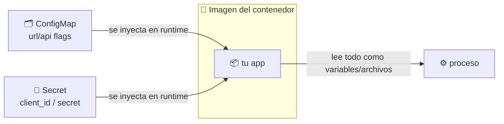
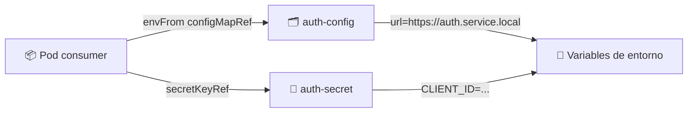

# 🗂️ ConfigMaps y Secrets

> La configuración de las apps no debe ir "cocinada" dentro de la imagen. **ConfigMap** (configuración no sensible) y **Secret** (datos sensibles) la inyectan desde el clúster.

## 🧠 ¿Qué son?

| Recurso | Contenido | Uso |
|---------|-----------|-----|
| 🗂️ **ConfigMap** | Configuración "aburrida": URLs, flags, variables | Inyectarla a los contenedores sin reconstruir imágenes |
| 🔐 **Secret** | Datos sensibles: claves de API, contraseñas, tokens | Lo mismo, pero **codificado y con más garantías** |



> 💡 La idea clave: **la imagen es inmutable e igual en todos lados**; la diferencia entre "dev" y "prod" vive en estos objetos.

## 🗂️ ConfigMap

### Declarativo: [auth-config.yml](auth-config.yml)

```yaml
apiVersion: v1
kind: ConfigMap
metadata:
  name: auth-config
data:
  url: "https://auth.service.local"
```

```bash
kubectl apply -f auth-config.yml
```

### Imperativo (sin archivo)

```bash
kubectl create configmap auth-config \
  --from-literal=url=https://auth.service.local
# Variante desde archivos:
kubectl create configmap auth-config --from-file=config.txt
```

## 🔐 Secret

### Imperativo (recomendado en el curso)

Kubernetes **codifica en base64** los valores por ti:

```bash
kubectl create secret generic auth-secret \
  --from-literal=client_id=myclientid \
  --from-literal=client_secret=secret
```

### Declarativo: [auth-secret.yml](auth-secret.yml)

```yaml
apiVersion: v1
kind: Secret
metadata:
  name: auth-secret
type: Opaque
data:
  client_id: "bXljbGllbnRpZA=="
  client_secret: "c2VjcmV0"
```

```bash
kubectl apply -f auth-secret.yml
```

> ⚠️ En el YAML los valores van **ya en base64** (tú los generas): `echo -n "myclientid" | base64` → `bXljbGllbnRpZA==`. Por eso el archivo es más frágil de mantener a mano que el comando `create secret generic`.

## 👀 Visualizarlos

```bash
# Ver metadatos (nunca muestra los valores directamente)
kubectl get configmap auth-config
kubectl get secret auth-secret

# Ver los valores (Secret muestra el base64; describe los oculta)
kubectl get secret auth-secret -o yaml
kubectl describe secret auth-secret
```

| Comando | Muestra los valores |
|---------|:-------------------:|
| `kubectl get secret auth-secret` | ❌ solo metadatos |
| `kubectl describe secret auth-secret` | ⚠️ tamaño de los datos, no el contenido en claro |
| `kubectl get secret auth-secret -o yaml` | 🔓 el base64 (aún hay que decodificarlo) |
| `echo "bXljbGllbnRpZA==" \| base64 -d` | ✅ el valor en claro |

> 🔑 **El base64 NO es encriptación**: cualquiera con acceso al clúster puede decodificarlo. Los Secrets reales se cifran con **KMS/Encryption at rest** y se gestionan con **External Secrets / CSI** (ver enlaces abajo).

## 🧩 Consumir la configuración en un Pod

ConfigMap y Secret se inyectan de dos formas:

| Forma | Uso |
|-------|-----|
| 🌱 **Variables de entorno** (`env` / `envFrom`) | `valueFrom.configMapKeyRef` o `secretKeyRef` |
| 📁 **Volumen montado** (`mountPath`) | Cada key expuesta como un archivo |

```yaml
apiVersion: v1
kind: Pod
metadata:
  name: consumer
spec:
  containers:
  - name: app
    image: nginx
    envFrom:
    - configMapRef:
        name: auth-config
    env:
    - name: CLIENT_ID
      valueFrom:
        secretKeyRef:
          name: auth-secret
          key: client_id
```



> 💡 Aplicar cambios de ConfigMap/Secret **no reinicia** los pods automáticamente: suele usarse un reinicio controlado (ej. `kubectl rollout restart deployment`) para que la app tome la nueva configuración.

## 🔗 Referencias

- [External Secrets Operator](https://external-secrets.io/latest/) — trae secretos desde Vault/AWS/Azure/GCP al clúster
- [Documentación de Secrets (K8s)](https://kubernetes.io/es/docs/concepts/configuration/secret/)
- [Documentación de ConfigMaps (K8s)](https://kubernetes.io/es/docs/concepts/configuration/configmap/)

## 🧭 Navegación

- 🌐 [Módulo anterior: Services e Ingress](../07-service-ingress/README.md)
- ↩️ [Inicio del curso](../README.md)

---

🧠 *Resumen del módulo "ConfigMaps y Secrets" del curso de Platzi.*