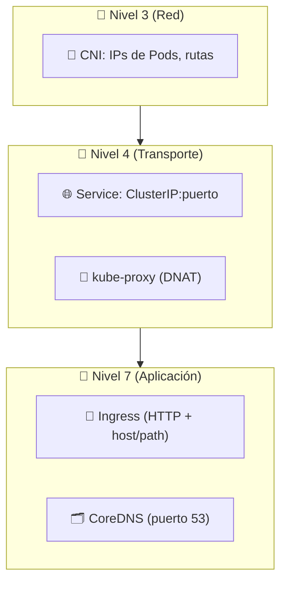
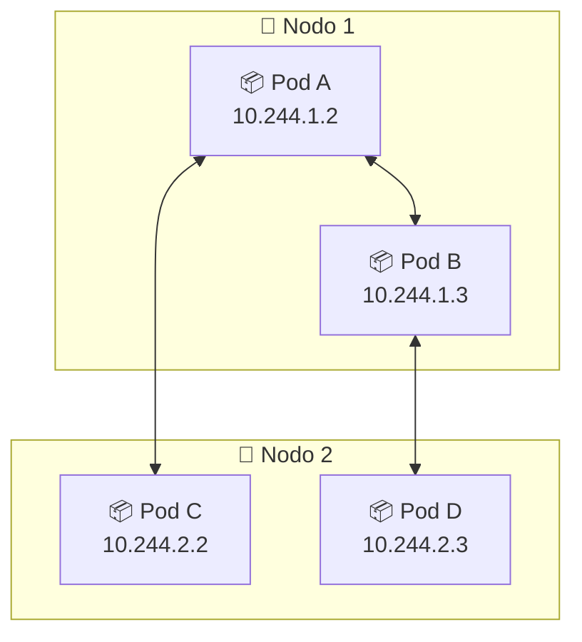
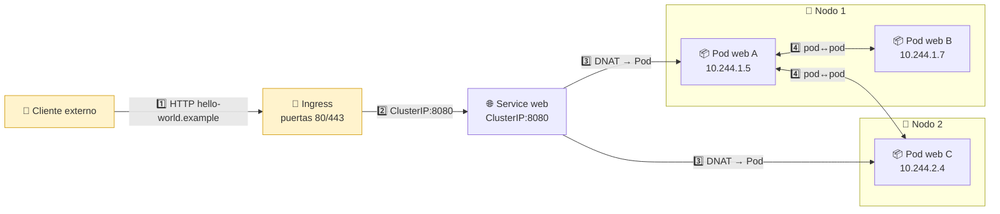
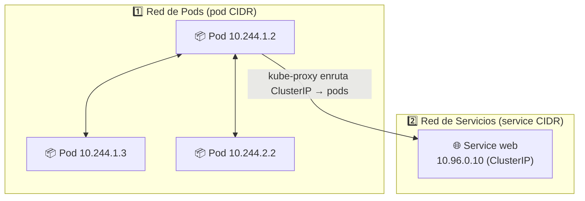
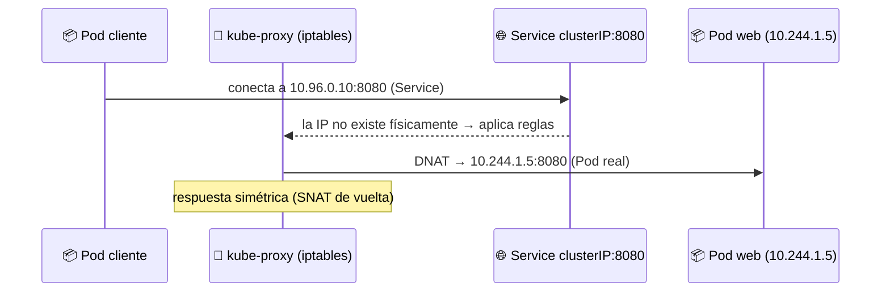
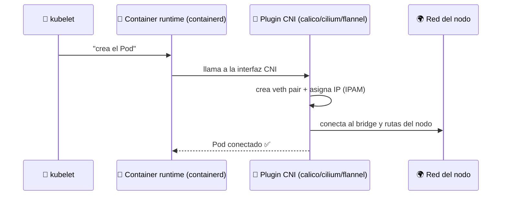
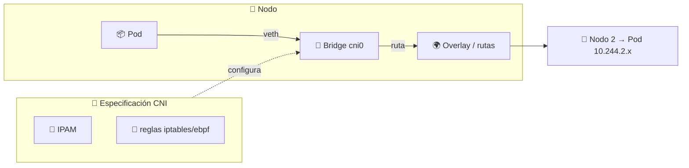
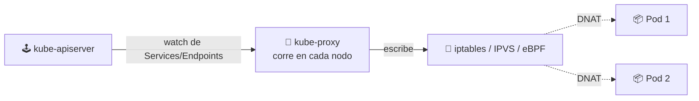
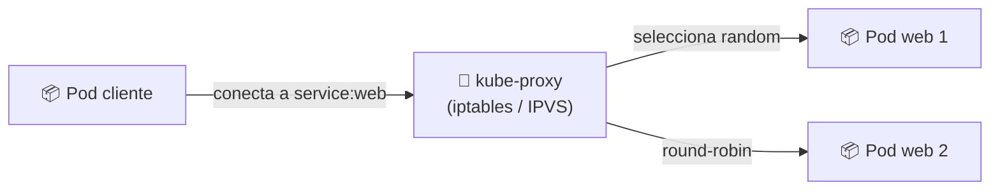

# 🌐 Networking en Kubernetes

> Kubernetes no usa el modelo de red "clásico" de contenedores sueltos: define un **plano de red plano** donde todo Pod tiene su propia IP y puede hablar con todos los demás sin NAT, en cualquier nodo.

## 📚 Fundamentos: modelo OSI y TCP/IP

Antes de sumergirnos en K8s, repasemos los dos modelos que explican cómo viajan los datos por la red. Todo lo que verás después (CNI, Services, Ingress) vive en estos niveles.

### 🌉 Modelo OSI de 7 capas

| Capa | Nombre | Función | Ejemplo |
|:----:|--------|---------|---------|
| 7 | 📝 **Aplicación** | Interacción con el usuario | HTTP, HTTPS, DNS, SSH |
| 6 | 🧹 **Presentación** | Formato/encodificación de datos | JPEG, SSL/TLS (histórico) |
| 5 | 💬 **Sesión** | Apertura/manejo de sesiones | Sockets, RPC |
| 4 | 🚚 **Transporte** | Entrega fiables extremo a extremo | TCP, UDP, puertos |
| 3 | 🧭 **Red** | Ruteo y direccionamiento lógico | IP, routers |
| 2 | 🧵 **Enlace de datos** | Tramas entre nodos vecinos | MAC, switch, Ethernet |
| 1 | ⚡ **Física** | Bits por el medio físico | Cables, ondas |

### 💻 Modelo TCP/IP de 4 capas (el que se usa "en la práctica")

| Capa TCP/IP | Equivale a OSI | Función |
|-------------|:--------------:|---------|
| 📝 **Aplicación** | 5, 6, 7 | HTTP, DNS, SSH |
| 🚚 **Transporte** | 4 | TCP/UDP + **puertos** |
| 🌐 **Internet** | 3 | IP, direccionamiento, ruteo |
| 🔗 **Acceso a red** | 1, 2 | Ethernet, Wi-Fi, MAC |

### 🔗 ¿Dónde encaja cada componente de Kubernetes?

Este es el mapa que usaremos en todo el módulo:



| Componente K8s | Nivel | Dato clave |
|----------------|:-----:|------------|
| 🔌 **CNI plugin** (Calico/Cilium/Flannel) | 3 | Asigna IPs a los Pods, rutas entre nodos |
| 🌐 **Service** + 🔀 **kube-proxy** | 4 | Trabaja con **puertos** (TCP/UDP), DNAT hacia los Pods |
| 🚪 **Ingress** | 7 | Enruta por **host y path** (HTTP), por eso habla TLS |
| 🗂️ **CoreDNS** | 7 | Resuelve nombres, puerto 53 |

> 💡 **Regla mental**: "la IP de un Pod es nivel 3, el Service que la balancea es nivel 4, y el Ingress que discrimina por URL es nivel 7". Ahora sí, vamos al modelo de red de Kubernetes.

## 🧠 El modelo de red de K8s

Cuatro reglas de oro:

1. 🔹 **Cada Pod tiene una IP única** dentro del clúster.
2. 🌍 **Todos los Pods pueden hablar entre sí** sin NAT, estén en el mismo nodo o no.
3. 🕵️ Los **agentes** (kubelet) ven los mismos pods que un Pod.
4. 🔒 El modelo **por defecto es abierto**; el aislamiento se define con *NetworkPolicies*.



## 🌍 La red de Kubernetes de un vistazo

Todo el módulo se resume en un flujo de extremo a extremo. Los cuatro "trayectos" posibles del tráfico:

| # | Trayecto | Qué lo implementa |
|---|----------|-------------------|
| 1️⃣ | 👤 Usuario → **Ingress** (port 80/443) | LoadBalancer/NodePort + **Ingress** |
| 2️⃣ | 🚪 Ingress → **Service** (ClusterIP:8080) | Ingress controller + kube-proxy (DNAT) |
| 3️⃣ | 🌐 Service → **Pod** (10.244.x.x:8080) | **kube-proxy** selecciona un Pod |
| 4️⃣ | 📦 Pod → Pod en **otro nodo** | **CNI plugin** (rutas/overlay) |



> 🧭 **Lectura del diagrama**: el usuario solo conoce el **Ingress**; el Service es la "dirección fija" interna y los Pods son el destino final garantizado por el CNI incluso cruzando nodos.

## 🧩 Capas de red

| Capa | Qué resuelve | Quién |
|------|--------------|-------|
| 📦 **Pod ↔ Pod** | IP única por pod, conectividad entre nodos | **CNI plugin** (Calico, Flannel, Cilium) |
| 🌐 **Pod ↔ Servicio** | IP estable, balanceo, descubrimiento | **Service + kube-proxy** |
| 🗂️ **Nombres** | DNS interno para los Services | **CoreDNS** |
| 🚪 **Fuera ↔ Clúster** | Exponer apps al exterior | **NodePort / LoadBalancer / Ingress** |

## 🧩 Dos planos de red: Pods y Servicios

Kubernetes en realidad mantiene **dos redes virtuales distintas** superpuestas:



| Red | Rango de IPs | Quién la implementa | Se ve desde |
|-----|--------------|---------------------|-------------|
| 📦 **Red de Pods** | Ej. `10.244.0.0/16` | **CNI plugin** | Dentro del clúster (sin NAT) |
| 🌐 **Red de Servicios** | Ej. `10.96.0.0/12` | **kube-apiserver** (asigna) + **kube-proxy** (enruta) | Virtual: no existe un nodo con esa IP |

> 💡 Cada Pod recibe su IP al desplegarse (**IPAM**, parte del CNI); el Service recibe su ClusterIP en el momento de crearlo y la mantiene fija de por vida. La IP "virtual" del Service no pertenece a ningún nodo físico: es solo reglas de enrutamiento.

### ¿Cómo viaja un paquete de un Pod al Service?



## 🏗️ La IP del Pod y el CNI

### ¿Qué es exactamente el CNI?

**CNI** (*Container Network Interface*) es una **especificación** (y un conjunto de plugins) que estandariza cómo se conectan a la red los contenedores. El **kubelet** no conoce las particularidades de Calico o Flannel: simplemente entrega el namespace de red del Pod al plugin CNI configurado y este "hace su magia".



### Responsabilidades de un plugin CNI

| Responsabilidad | Qué hace |
|-----------------|----------|
| 🔗 **Crear el par veth** | Un "cable virtual" entre el Pod y el bridge del nodo |
| 💾 **IPAM** (IP Address Management) | Asignar y reservar una IP única al Pod |
| 📝 **Reglas de red** | Rutas, iptables/ebpf para que el tráfico fluya entre nodos |
| ⚡ **Teardown** | Limpiar la interfaz cuando el Pod muere |

### Los plugins más usados

| Plugin | Enfoque | NetworkPolicies | Cuándo elegirlo |
|--------|---------|:---------------:|-----------------|
| 🦙 **Calico** | Rutas y ACLs (sin overlay opcional) | ✅ | Estándar, muy usado en producción |
| 🧣 **Flannel** | Overlay VXLAN simple | ❌ | Clústeres simples de laboratorio |
| 🔃 **Cilium** | eBPF (altísima perf.) | ✅ | Seguridad y observabilidad avanzada |



> 💡 En **minikube** y **Docker Desktop** la red del clúster ya viene preconfigurada (un bridge por nodo); el **kube-proxy** y CoreDNS son parte del plano de red por defecto.

## 🌐 Pod ↔ Service: kube-proxy

Los Pods mueren y cambian de IP; el **Service** da una IP y un nombre **estables**. Pero el Service **no es un proceso real**: es una **definición** del API. Quien la "materializa" en reglas de red reales es **kube-proxy**.

### ¿Qué es kube-proxy?

Es el **agente de red que corre en cada nodo**. Vigila el API server (watch) y, cuando aparece o cambia un Service/Endpoints, escribe las reglas que hacen que la ClusterIP "virtual" llegue de verdad a los Pods.



### Modos de funcionamiento

| Modo | Tecnología | Cómo balancea | Uso |
|------|-----------|----------------|-----|
| 🧱 **iptables** (*default*) | Reglas en la tabla NAT de Linux | Random de las reglas | Simple, clásico |
| 🧵 **IPVS** | Tablas kernel (ip_vs) | Round-robin, least-conn, hash... | Alto rendimiento, más escalable |
| ⚡ **eBPF** | Programas del kernel | XDP/conntrack | Con **Cilium**, máxima performance |

| Mecanismo | Rol en el flujo |
|-----------|-----------------|
| **DNAT** | Reescribe la ClusterIP destino → IP real del Pod |
| **SNAT** | En el regreso, hace visible el origen (para que el Pod responda) |
| **conntrack** | Mantiene correlación de la conexión para la vuelta simétrica |

### ¿Por qué no "simplemente" direccionar IPs?

La ClusterIP es **virtual** — ningún nodo físico la tiene. kube-proxy la traduce a las IPs de los Pods (que son cambiantes y pueden vivir en cualquier nodo), de ahí el "truco" de iptables/IPVS.

| Pieza | Función |
|-------|---------|
| 🎯 **Service** | Define clusterIP:8080 y selecciona pods por labels |
| 📄 **Endpoints** | La lista real de IPs:puerto de los pods vivos |
| 🔀 **kube-proxy** | Transforma "service:8080" en "pod1/pod2:8080" |



| Concepto | Detalle |
|----------|---------|
| **ClusterIP** | IP virtual del Service, solo interna |
| **kube-proxy** | Escribe reglas iptables/IPVS para redirigir a los Pods |
| **Endpoints** | Lista real de IPs de Pods detrás del Service (job del controlador de endpoints) |

> 🔍 Todo lo relacionado con **Egress/eco al exterior** (NodePort, LoadBalancer, Ingress) se profundiza en [Services e Ingress](../07-service-ingress/README.md).

## 🗂️ DNS interno: CoreDNS

Cada Service en el clúster recibe un **nombre DNS**: `web`, `web.default.svc.cluster.local`.

```bash
# Dentro de un Pod, resolver por nombre el Service creado:
kubectl exec -it <pod> -- nslookup web.default.svc.cluster.local
```

> 🧠 Los microservicios se descubren entre sí **por nombre** (DNS del Service), sin conocer IPs de Pods que cambian constantemente.

## 🔒 NetworkPolicies: controlar el tráfico

Por defecto todo Pod habla con todo. Una **NetworkPolicy** restringe el tráfico por **labels** de origen/destino, puertos, e ingress/egress.

```yaml
apiVersion: networking.k8s.io/v1
kind: NetworkPolicy
metadata:
  name: api-only-db
spec:
  podSelector:
    matchLabels:
      app: db
  policyTypes: ["Ingress"]
  ingress:
  - from:
    - podSelector:
        matchLabels:
          app: api
    ports:
    - protocol: TCP
      port: 5432
```

| Aspecto | Valor |
|---------|-------|
| Aplica a | Pods que matcheen `podSelector` |
| Tipos | `Ingress` (entrante) y `Egress` (saliente) |
| Requisito | La soporta el **CNI** (Calico/Cilium sí; Flannel no) |

## 🧭 Navegación

- 🗂️ [Módulo anterior: ConfigMaps y Secrets](../08-configs-secrets/README.md)
- ↩️ [Inicio del curso](../README.md)

---

🧠 *Resumen del módulo "Networking" del curso de Platzi.*