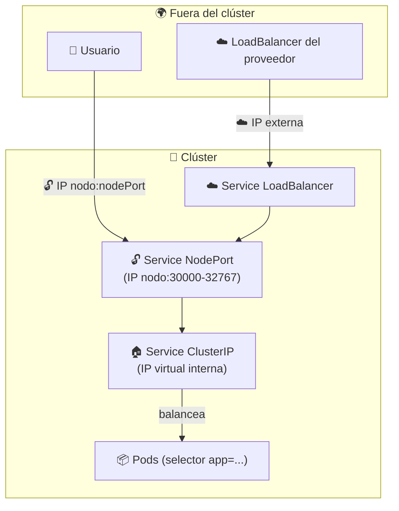

# 🔀 Tipos de Services: ClusterIP, NodePort, LoadBalancer y ExternalName

> Un **Service** da a los Pods una dirección **estable** (IP + DNS). Pero según *a quién* quieras exponer la app, eliges un **tipo** distinto. Este módulo repasa los cuatro tipos y cuándo usar cada uno.

## 🧭 Los 4 tipos de un vistazo

| Tipo | Alcance | IP / puerto | Caso de uso |
|------|---------|-------------|-------------|
| 🏠 **ClusterIP** *(default)* | Interno | IP virtual interna | Microservicios que se hablan entre sí |
| 🔓 **NodePort** | Externo | IP del nodo + puerto `30000-32767` | Pruebas / acceso directo sin balanceador |
| ☁️ **LoadBalancer** | Externo | IP externa del proveedor | Producción en la nube (AWS/GCP/Azure) |
| 🔗 **ExternalName** | Alias DNS | Nombre de dominio externo | Conectar servicios fuera del clúster |



> 💡 **Regla mental**: `LoadBalancer` se apoya en `NodePort`, y `NodePort` se apoya en `ClusterIP`. Cada tipo se construye sobre el anterior; **ClusterIP es la base siempre presente**.

## 🔢 Anatomía de los puertos

Antes de ver cada tipo, los tres puertos que aparecen en los manifiestos:

| Campo | Significa | Quién lo usa |
|-------|-----------|--------------|
| 🎯 **`targetPort`** | Puerto **del Pod** donde escucha la app | El Service reenvía hacia aquí |
| 🏠 **`port`** | Puerto del **Service** (su ClusterIP) | Otros Pods / recursos dentro del clúster |
| 🔓 **`nodePort`** | Puerto abierto en **cada nodo** (`30000-32767`) | Tráfico que entra desde fuera |

```yaml
ports:
  - port: 80        # el Service escucha en el puerto 80
    targetPort: 8080  # reenvía al puerto 8080 del Pod
    nodePort: 30007   # y abre el 30007 en todos los nodos
```

> 💡 `port` y `targetPort` **pueden diferir**: el Service recibe en el `80` y entrega al Pod en el `8080`. `nodePort` solo aplica a `NodePort` y `LoadBalancer`.

## 🏠 ClusterIP (default)

Es el tipo **predeterminado**. Expone el Service con una **IP virtual interna**, accesible **solo dentro del clúster**. No se puede llegar a él desde fuera.

**Casos de uso**: microservicios que se comunican entre sí, bases de datos internas, colas de mensajes.

### Manifiesto: [deployment-clusterip.yaml](deployment-clusterip.yaml)

```yaml
apiVersion: v1
kind: Service
metadata:
  name: hello-service-clusterip
spec:
  type: ClusterIP
  selector:
    app: hello-clusterip
  ports:
    - port: 80
      targetPort: 8080
```

```bash
kubectl apply -f deployment-clusterip.yaml
kubectl get svc hello-service-clusterip
#   NAME                        TYPE        CLUSTER-IP   PORT(S)   AGE
#   hello-service-clusterip     ClusterIP   10.96.0.10   80/TCP    1m
```

> 🧠 Dentro del clúster, el Service se resuelve por **DNS**: `hello-service-clusterip.default.svc.cluster.local`. Los Pods se conectan por ese nombre, nunca por la IP de otro Pod.

```bash
# Probar desde dentro del clúster (desde un Pod temporal):
kubectl run test --rm -it --image=busybox --restart=Never -- wget -qO- http://hello-service-clusterip
```

### 🔌 Acceder desde tu máquina (sin minikube)

Como `ClusterIP` es **solo interno**, no tiene URL directa. El curso usa `minikube service hello-service-clusterip` para crear un túnel; con **Docker Desktop** (o cualquier clúster sin minikube) el equivalente es `kubectl port-forward`:

```bash
# Equivalente a: minikube service hello-service-clusterip
kubectl port-forward service/hello-service-clusterip 8080:80
# → http://localhost:8080
```

| Comando | Qué hace |
|---------|----------|
| `minikube service hello-service-clusterip` | Túnel/URL que crea minikube (requiere minikube) |
| `kubectl port-forward service/hello-service-clusterip 8080:80` | Túnel equivalente, funciona en cualquier clúster |

> 💡 El mapeo es `localhost:8080 → Service:80 → Pod:8080` (el Service escucha en `port: 80` y reenvía al `targetPort: 8080`). El comando **bloquea la terminal**: déjalo corriendo mientras pruebas (o ábrelo en otra pestaña).

## 🔓 NodePort

Expone el Service en un **puerto fijo de cada nodo** (rango `30000-32767`). Permite acceder desde fuera usando `<IP-del-nodo>:<nodePort>`.

**Casos de uso**: pruebas, laboratorios, o cuando no hay un balanceador en la nube. En producción suele reemplazarse por `LoadBalancer` o `Ingress`.

### Manifiesto: [deployment-nodeport.yaml](deployment-nodeport.yaml)

```yaml
apiVersion: v1
kind: Service
metadata:
  name: hello-service-np
spec:
  type: NodePort
  selector:
    app: hello-nodeport
  ports:
    - port: 80
      targetPort: 8080
      nodePort: 30007
```

```bash
kubectl apply -f deployment-nodeport.yaml
kubectl get svc hello-service-np
#   NAME              TYPE       CLUSTER-IP   PORT(S)        AGE
#   hello-service-np  NodePort   10.96.0.11   80:30007/TCP   1m
```

| Entorno | Acceso al NodePort |
|---------|--------------------|
| 🌀 minikube | `minikube service hello-service-np --url` |
| 🐳 Docker Desktop | `http://localhost:30007` |

> 🔑 Si **omites** `nodePort`, Kubernetes asigna uno aleatorio del rango `30000-32767`. Fijarlo (como aquí con `30007`) lo hace predecible.

## ☁️ LoadBalancer

Crea un **balanceador de carga externo** en el proveedor de nube (AWS ELB, GCP LB, Azure LB) y le asigna una **IP externa** para acceder al Service desde Internet.

**Casos de uso**: aplicaciones en producción que requieren alta disponibilidad y reparto de tráfico entre múltiples Pods (APIs, sitios web).

### Manifiesto: [deployment-loadbalancer.yaml](deployment-loadbalancer.yaml)

```yaml
apiVersion: v1
kind: Service
metadata:
  name: hello-service-loadbalancer
spec:
  type: LoadBalancer
  selector:
    app: hello-loadbalancer
  ports:
    - port: 80
      protocol: TCP
      targetPort: 8080
```

```bash
kubectl apply -f deployment-loadbalancer.yaml
kubectl get svc hello-service-loadbalancer
#   NAME                       TYPE           CLUSTER-IP   EXTERNAL-IP   PORT(S)
#   hello-service-loadbalancer LoadBalancer   10.96.0.12   <pending>     80:30008/TCP
```

> ☁️ `EXTERNAL-IP` queda en `<pending>` hasta que el proveedor asigna la IP real. En la nube, `LoadBalancer` internamente crea un `NodePort` y lo enruta al balanceador.

### 🌀 Simularlo en local con minikube

```bash
# En una terminal aparte: asigna una IP externa simulada (localhost)
minikube tunnel
```

Con `minikube tunnel`, la `EXTERNAL-IP` deja de estar `pending` y se puede acceder al Service.

## 🔗 ExternalName

No redirige tráfico a Pods: **no tiene `selector`**. Actúa como un **alias DNS** que resuelve el nombre del Service a un dominio externo. Así, la app dentro del clúster sigue usando un nombre "de siempre" y tú cambias el destino solo en un lugar.

**Casos de uso**: integrar servicios externos (fuera del clúster) con aplicaciones dentro del clúster, por ejemplo una base de datos gestionada (RDS, Cloud SQL) o un API de un tercero.

### Manifiesto: [externalname.yaml](externalname.yaml)

```yaml
apiVersion: v1
kind: Service
metadata:
  name: my-database-service
spec:
  type: ExternalName
  externalName: my-database.cluster-abcdef123456.us-west-2.rds.amazonaws.com
```

```bash
kubectl apply -f externalname.yaml
kubectl get svc my-database-service
#   NAME                 TYPE           CLUSTER-IP   EXTERNAL-IP                            PORT(S)
#   my-database-service  ExternalName   <none>       my-database.cluster-...rds.amazonaws.com   <none>
```

> 💡 La app se conecta a `my-database-service` y Kubernetes la resuelve al hostname de RDS. Si la base cambia de endpoint, solo actualizas `externalName`, sin tocar el código.

## 🧠 Resumen: ¿cuándo usar cuál?

| Necesitas... | Usa |
|--------------|:---:|
| Comunicación solo interna (microservicios, DB) | 🏠 ClusterIP |
| Acceso externo rápido, sin balanceador | 🔓 NodePort |
| Balanceador gestionado y HA en la nube | ☁️ LoadBalancer |
| Un alias DNS a un servicio externo al clúster | 🔗 ExternalName |

> ⚠️ **En entornos reales**, para HTTP/HTTPS con rutas y hostnames suele usarse **Ingress** por delante (ver [Services e Ingress](../07-service-ingress/README.md)). Los `Service` de este módulo son la "dirección estable" a la que Ingress enruta.

## 📚 Documentación

- [Accessing apps with Services](https://kubernetes.io/es/docs/concepts/services-networking/service/)
- [minikube: accessing apps](https://minikube.sigs.k8s.io/docs/handbook/accessing/)

## 🧭 Navegación

- 🌐 [Módulo anterior: Networking](../09-networking/README.md)
- ↩️ [Inicio del curso](../README.md)

---

🧠 *Resumen del módulo "Tipos de Services: ClusterIP, NodePort, LoadBalancer y ExternalName" del curso de Platzi.*
